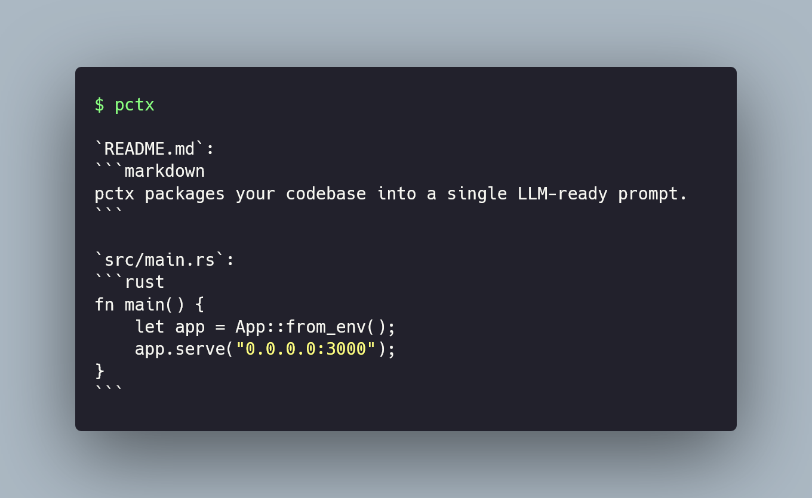

# pctx

<p align="center">
  
</p>

Generate LLM-ready context from your codebase. Intelligently packages source files with proper formatting, truncation, and filtering for optimal AI assistant consumption.


## Features

- **Smart file discovery**: Respects `.gitignore`, excludes binary files, and filters common non-source directories
- **Multiple output formats**: Markdown (default), XML, and plain text
- **Intelligent truncation**: Preserves file head and tail when truncating large files
- **Flexible filtering**: Include/exclude patterns with gitignore-style syntax
- **Multiple destinations**: stdout, clipboard, or file output
- **JSON mode**: Structured output for programmatic use and CI/CD integration
- **Stdin support**: Read file lists from pipes for integration with other tools
- **Token estimation**: Approximate token counts for various LLM models

## Installation

```bash
cargo install pctx
```

Or build from source:

```bash
git clone https://github.com/mc-marcocheng/pctx
cd pctx
cargo build --release
```

## Quick Start

```bash
# Generate context for current directory
pctx

# Copy to clipboard
pctx --clipboard

# Write to file
pctx --output context.md

# JSON output for scripts
pctx --json

# Filter specific files
pctx --include "*.rs" --include "*.toml"
pctx --exclude "*.test.ts" --exclude "__tests__"

# Pipe file list from other tools
find . -name "*.rs" -mtime -7 | pctx --stdin
pctx files list --quiet | grep -v test | pctx --stdin

# Preview without generating
pctx --dry-run

# Include file tree in output
pctx --tree

# Disable truncation for full file contents
pctx --no-truncation
```

## Usage

### Basic Commands

```bash
# Default: generate context from current directory
pctx [OPTIONS] [PATHS...]

# List files that would be included
pctx files list [OPTIONS]

# Show file tree structure
pctx files tree [OPTIONS]

# Configuration management
pctx config show      # Show current config
pctx config init      # Create .pctx.toml
pctx config defaults  # List default excludes

# Generate shell completions
pctx completions bash
pctx completions zsh
pctx completions fish
```

### Output Options

| Flag | Description |
|------|-------------|
| `--clipboard`, `-c` | Copy output to system clipboard |
| `--output FILE`, `-o` | Write to file (use `--force` to overwrite) |
| `--format`, `-f` | Output format: `markdown`, `xml`, `plain` |
| `--tree`, `-t` | Include file tree at beginning of output |
| `--stats`, `-s` | Show statistics summary |
| `--json` | Structured JSON output (for scripts) |
| `--stdin` | Read file paths from stdin (one per line) |

### Filtering Options

| Flag | Description |
|------|-------------|
| `--exclude PATTERN`, `-e` | Exclude files matching pattern (repeatable) |
| `--include PATTERN`, `-i` | Include only files matching pattern (repeatable) |
| `--hidden` | Include hidden files (starting with `.`) |
| `--no-default-excludes` | Disable built-in exclusions |
| `--no-gitignore` | Ignore `.gitignore` rules |
| `--max-size KB` | Maximum file size in KB (default: 1024) |
| `--max-depth N`, `-d` | Limit directory recursion depth |

### Truncation Options

| Flag | Description |
|------|-------------|
| `--no-truncation` | Disable all truncation |
| `--max-lines N` | Max lines per file before truncating (default: 500, 0 = unlimited) |
| `--head-lines N` | Lines to keep at file start (default: 20) |
| `--tail-lines N` | Lines to keep at file end (default: 10) |
| `--max-line-length N` | Max chars per line (default: 500, 0 = unlimited) |
| `--head-chars N` | Chars to keep at line start (default: 200) |
| `--tail-chars N` | Chars to keep at line end (default: 100) |

### Stdin Mode

The `--stdin` flag allows reading file paths from standard input, enabling powerful integrations:

```bash
# Process only recently modified Rust files
find . -name "*.rs" -mtime -1 | pctx --stdin

# Process files from a list
cat files_to_review.txt | pctx --stdin

# Chain with pctx's own file listing
pctx files list --quiet | grep -v _test | pctx --stdin

# Use with git to process only changed files
git diff --name-only HEAD~5 | pctx --stdin

# Process files matching complex criteria
fd -e rs -e toml --changed-within 2weeks | pctx --stdin
```

When using `--stdin`:
- Empty lines and whitespace-only lines are ignored
- Non-existent files are skipped with a warning (in verbose mode)
- Directories in the input are expanded recursively

## Configuration

### Config File

Create a `.pctx.toml` file in your project root:

```bash
pctx config init
```

Example configuration:

```toml
# Patterns to exclude (in addition to defaults)
exclude = [
    "*.generated.ts",
    "vendor/",
    "__snapshots__",
]

# Patterns to include (if specified, only these are included)
include = [
    "*.rs",
    "*.toml",
]

# Truncation settings
max_lines = 500
head_lines = 20
tail_lines = 10
max_line_length = 500
```

Configuration is loaded from `.pctx.toml` in the current directory or any parent directory. If the config file exists but has syntax errors, a warning is printed and the file is skipped.

### Configuration Precedence

Settings are applied in this order (highest priority first):

1. Command-line arguments
2. Config file (`.pctx.toml`)
3. Built-in defaults

### Default Exclusions

Common directories and files are excluded by default:

- **Version control**: `.git`, `.svn`, `.hg`
- **Dependencies**: `node_modules`, `vendor`, `target`, `.venv`
- **Build outputs**: `dist`, `build`, `out`, `bin`, `obj`
- **IDE/Editor**: `.idea`, `.vscode`, `.vs`
- **Caches**: `__pycache__`, `.cache`, `.pytest_cache`
- **Lock files**: `package-lock.json`, `yarn.lock`, `Cargo.lock`, etc.

See all defaults with: `pctx config defaults`

## Pattern Syntax

Patterns follow gitignore-style syntax:

| Pattern | Matches |
|---------|---------|
| `*.log` | All `.log` files |
| `test_*` | Files starting with `test_` |
| `**/tests/**` | Any `tests` directory at any level |
| `/src/generated` | `src/generated` at root only |
| `docs/` | `docs` directory |

**Limitations:**
- Negation patterns (`!pattern`) are not supported and will show a warning
- Character classes (`[abc]`) depend on glob crate support
- Some edge cases with `**/` patterns may differ from git behavior

## JSON Output

Use `--json` for structured output suitable for scripts and CI/CD:

```bash
# Generate context with JSON output
pctx --json

# List files as JSON
pctx files list --json

# Parse with jq
pctx --json | jq '.data.files[] | select(.truncated) | .path'
```

### Response Format

**Success:**
```json
{
  "status": "success",
  "data": {
    "content": "...",
    "format": "markdown",
    "files": [
      {
        "path": "src/main.rs",
        "extension": "rs",
        "size_bytes": 1234,
        "line_count": 45,
        "truncated": false
      }
    ]
  },
  "stats": {
    "file_count": 10,
    "total_lines": 500,
    "total_bytes": 15000,
    "truncated_count": 2,
    "skipped_count": 0,
    "token_estimate": 3500,
    "duration_ms": 45
  }
}
```

**Error:**
```json
{
  "status": "error",
  "code": "file_not_found",
  "message": "File not found: src/missing.rs",
  "input": {"path": "src/missing.rs"},
  "suggestion": "Check that the path exists and is spelled correctly",
  "transient": false,
  "exit_code": 3
}
```

**Partial Success:**
```json
{
  "status": "partial",
  "data": { ... },
  "stats": { ... },
  "errors": [
    {
      "path": "src/broken.rs",
      "code": "permission_denied",
      "message": "Permission denied",
      "transient": false
    }
  ]
}
```

## Exit Codes

| Code | Meaning |
|------|---------|
| 0 | Success |
| 1 | General failure |
| 2 | Usage error (bad arguments) |
| 3 | File/directory not found |
| 4 | Permission denied |
| 5 | Conflict (output file exists) |
| 6 | No files matched filters |
| 7 | Partial success (some files failed) |

## Examples

### Basic Usage

```bash
# Current directory to stdout
pctx

# Specific paths
pctx src/ tests/ README.md

# Copy to clipboard for pasting into ChatGPT
pctx --clipboard

# Save to file
pctx --output context.md
pctx -o context.md --force  # Overwrite existing
```

### Filtering

```bash
# Only Rust files
pctx --include "*.rs"

# Exclude tests
pctx --exclude "*_test.go" --exclude "**/__tests__/**"

# Include hidden files
pctx --hidden

# Disable default excludes (include node_modules, etc.)
pctx --no-default-excludes
```

### Output Formats

```bash
# Markdown (default) - good for most LLMs
pctx --format markdown

# XML - useful for Claude
pctx --format xml

# Plain text - minimal formatting
pctx --format plain
```

### Working with Large Codebases

```bash
# Limit recursion depth
pctx --max-depth 2

# Disable truncation for full content
pctx --no-truncation

# Custom truncation settings
pctx --max-lines 1000 --head-lines 50 --tail-lines 25

# Smaller file size limit
pctx --max-size 100  # 100KB max

# Preview what would be included
pctx --dry-run
pctx --dry-run --json  # With file details
```

### CI/CD Integration

```bash
# Check if context generation would succeed
pctx --dry-run --json > /dev/null && echo "OK" || echo "Failed"

# Generate context and check size
pctx --json | jq -e '.stats.token_estimate < 100000'

# List large files
pctx files list --json | jq '.data[] | select(.size_bytes > 50000)'

# Process only changed files in a PR
git diff --name-only origin/main | pctx --stdin --json
```

### Integration with Other Tools

```bash
# Process files found by fd/find
fd -e py -e js | pctx --stdin

# Process files from ripgrep matches
rg -l "TODO" | pctx --stdin

# Process git-tracked files only
git ls-files | pctx --stdin

# Combine with file filtering
pctx files list -q | grep -E '\.(rs|toml)$' | pctx --stdin
```

## Shell Completions

Generate completions for your shell:

```bash
# Bash
pctx completions bash > ~/.local/share/bash-completion/completions/pctx

# Zsh
pctx completions zsh > ~/.zfunc/_pctx

# Fish
pctx completions fish > ~/.config/fish/completions/pctx.fish

# PowerShell
pctx completions powershell > $PROFILE.CurrentUserAllHosts
```

## Troubleshooting

### "No files matched the specified filters"

- Check that your paths exist: `ls <path>`
- Try `--no-default-excludes` to include commonly excluded directories
- Use `pctx files list` to see what files would be included
- Check your `.pctx.toml` for overly restrictive patterns

### Clipboard not working on Linux

Clipboard access requires a display server. Make sure:
- You're running in a graphical environment (X11 or Wayland)
- `xclip` or `wl-clipboard` is installed

### Config file not being applied

If your `.pctx.toml` has syntax errors, pctx will warn and continue without it:
```
Warning: failed to load config file: TOML parse error...
```

Check your config syntax with:
```bash
pctx config show
```

### Files being truncated unexpectedly

Use `--no-truncation` to disable truncation, or adjust thresholds:
```bash
pctx --max-lines 1000 --max-line-length 1000
```

### Binary files being included

Binary files should be automatically detected and skipped. If a binary file is being included:
- Check if it has a text-like extension
- Use `--exclude` to explicitly exclude it

## License

MIT License - see [LICENSE](LICENSE) for details.

## Contributing

Contributions welcome! Please read [CONTRIBUTING.md](CONTRIBUTING.md) first.

```bash
# Run tests
cargo test

# Run with verbose output
cargo run -- --verbose .

# Run integration tests
cargo test --test integration_test
```
